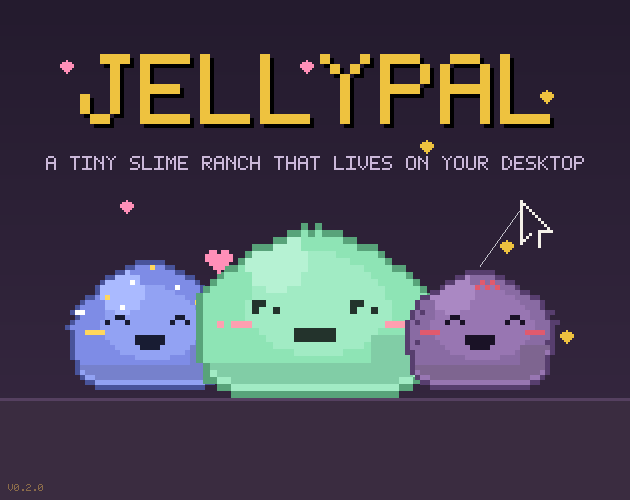

<p align="center">
  
</p>

<h1 align="center">JellyPal</h1>

<p align="center">
  A tiny pixel-art slime ranch that lives on your desktop.<br>
  Type to feed it. Collect, breed, decorate — it just vibes while you work.
</p>

<p align="center">
  <a href="https://jellypal.fun"><b>jellypal.fun</b></a> ·
  <a href="https://gyeongbin.itch.io/jellypal">itch.io</a> ·
  <a href="https://github.com/gyeongbin-38/JellyPal/releases">Releases</a>
</p>

<p align="center">
  
</p>

## Download

| | |
|---|---|
| **Website** | **[jellypal.fun](https://jellypal.fun)** — installer + portable zip, SHA-256 listed |
| **itch.io** | [gyeongbin.itch.io/jellypal](https://gyeongbin.itch.io/jellypal) — auto-updates via the itch app |
| **GitHub** | [Releases](https://github.com/gyeongbin-38/JellyPal/releases) |

**Windows 10/11 64-bit**, WebView2 Runtime (preinstalled on Win11). ~1.6 MB. **macOS (Apple Silicon)** dmg on [Releases](https://github.com/gyeongbin-38/JellyPal/releases) — unsigned, right-click → Open. Build your own: [MACBUILD.md](MACBUILD.md).

## What it does

- **Lives on your desktop** — a transparent, always-on-top overlay that stays click-through until you hover a slime
- **Typing feeds it** — keystrokes are *counted*, never read. Typing earns jelly to spend
- **60+ species** — gacha pulls, rarity tiers, daily/weekly bonuses, a dex to fill
- **Breeding** — cross species into one-of-a-kind hybrids born as babies (pacifier included)
- **Personalities** — 16 psych types; slimes perch on your window tops, nap on cushions, hide in boxes, dangle from your cursor
- **Decorate** — furniture props you can place and drag: bowls, cushions, plants, speakers, mirrors
- **Photo mode** — pose and snap shots into the album
- **Pomodoro** — optional focus/break timer the slime runs with you
- **Weather** — optional ambient weather on the ranch
- **Interact** — drag, throw, tickle, pet, toss treats (right-click the cookie to pick the snack)

## Privacy

- Keystrokes are counted, **never read** — no content ever leaves the key counter
- No account, no ads, no tracking, no analytics
- Purchases are server-verified Ed25519-signed grants bound to your anonymous install ID (`JP…`) — no email required

## Build from source

```bash
npm ci
npm run tauri build -- --bundles nsis   # Windows
npm run tauri build -- --bundles app    # macOS — see MACBUILD.md
```

Requires Node + Rust. Windows builds happen on Windows (see the `C:\build` staging dance in repo notes); macOS builds on any Mac or via the CI workflow.

## Layout

```
src/            pixel-art frontend — one big canvas app (main.js)
src-tauri/      Rust backend — overlay window, click-through poll,
              global hooks, save files, signed grant verify
server/         Cloudflare worker — redeem/claim/grant API, KV store
site/           jellypal.fun — marketing page + hosted downloads
.github/        CI — cargo check + tests on windows & macos, dmg bundle
```

## Save data

`%APPDATA%\com.jellypal.desktop\` — `state.json` (collection, jelly, props),
`photos/` (photo mode shots), `clickdbg.json` / `crash.log` (diagnostics).
Settings → RESET → SURE? wipes it all.

---
made with 🫠 for small computers
